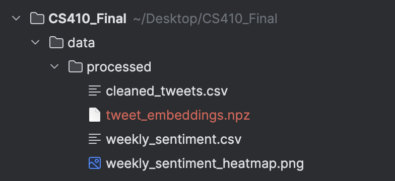

# Tweet Sentiment Pipeline + Semantic Search Chat

A full data-processing and question-answering pipeline for stock-related tweets.

## Dataset Source
Raw tweet dataset:
https://www.kaggle.com/datasets/equinxx/stock-tweets-for-sentiment-analysis-and-prediction/data

Place `stock_tweets.csv` into (Dataset is already checked into github. This step can be skipped): 
```
data/raw/stock_tweets.csv
```

## Dependencies

### Python Packages
```
pip install pandas numpy matplotlib textblob ollama
pip install python-dateutil tqdm
```

### TextBlob Corpora
```
python -m textblob.download_corpora
```

### Ollama
Install: https://ollama.com/download

Required models:
```
ollama pull llama3
ollama pull nomic-embed-text
```
Start Olama:
```
ollama serve
```

## Embedding Cache (Optional)
Avoid long embedding computation by downloading a prebuilt cache:

https://drive.google.com/file/d/1rdG6ZkxVc4VZpG5DUcMLsRqkUxpUu3qi/view?usp=drive_link

Place it here:
```
data/processed/tweet_embeddings.npz
```

## Project Structure
```
project/
│
├── main.py
├── data/
│   ├── raw/
│   │   └── stock_tweets.csv
│   └── processed/
│       ├── cleaned_tweets.csv
│       ├── weekly_sentiment.csv
│       ├── weekly_sentiment_heatmap.png
│       ├── tweet_embeddings.npz
└── README.md
```

## Design
The project implements an end-to-end pipeline for processing stock-related tweets, analyzing sentiment, generating visual summaries, and enabling semantic-search-powered question answering through a local LLM. The system is composed of four major subsystems that operate sequentially but are modular enough to run independently.

---

### **1. Data Ingestion & Normalization**
**Goal:** Load the raw Kaggle dataset and transform it into a consistent internal representation.

**Key operations:**
- Load `stock_tweets.csv` from `data/raw/`.
- Rename columns for consistency (`Tweet → text`, `Stock Name → ticker`, `Date → tweet_datetime`).
- Convert timestamp text into Python `datetime` objects.
- Validate rows, remove malformed entries.

**Output:** In-memory Pandas DataFrame with normalized schema.

---

### **2. Text Cleaning & Sentiment Analysis**
**Goal:** Prepare tweet text for NLP tasks and compute sentiment polarity.

**Text Cleaning Pipeline:**
- Lowercasing  
- Remove URLs  
- Remove `@mentions` and hashtags  
- Strip punctuation and non-alphanumeric characters  
- Collapse whitespace  

**Sentiment Computation:**
- Use **TextBlob** to compute polarity → float in range `[-1, +1]`.
- Append polarity to the DataFrame.

**Outputs:**
- Cleaned dataset saved to `data/processed/cleaned_tweets.csv`.

---

### **3. Weekly Sentiment Aggregation & Heatmap Visualization**
**Goal:** Convert noisy tweet-level sentiment into structured time-series insights.

**Aggregation Steps:**
- Convert timestamps to weekly periods (`dt.to_period("W")`).
- Compute average sentiment per `(ticker, week)` pair.
- Output stored in `weekly_sentiment.csv`.

**Visualization:**
- Pivot ticker × week into a 2D matrix.
- Use Matplotlib to generate a heatmap with:
  - Coolwarm colormap (`–1 = negative`, `+1 = positive`)
  - Downsampled X-axis labels for readability

**Output Files:**
- `data/processed/weekly_sentiment.csv`
- `data/processed/weekly_sentiment_heatmap.png`

---

### **4. Embedding Generation & Semantic Search**
**Goal:** Enable natural-language queries over large tweet collections.

**Embedding Engine:**  
- Uses **Ollama's `nomic-embed-text` model**.
- Converts each cleaned tweet into a dense vector embedding.
- Embeddings cached in `tweet_embeddings.npz` to avoid recomputation.

**Semantic Search Flow:**
1. Convert user query into an embedding vector.
2. Compute cosine similarity between query vector and all tweet vectors.
3. Select top-K most relevant tweets.
4. Build a context snippet summarizing these tweets.

This module powers downstream LLM reasoning by providing information retrieval over textual data.

---

### **5. Local LLM Chat Interface (Query Answering System)**
**Goal:** Allow users to ask questions about the tweets and receive LLM-generated answers grounded only in retrieved tweets.

**Model:**  
- Uses Ollama’s **`llama3`** chat model.

**Chat Loop:**
1. User enters a question.
2. System retrieves top-K most relevant tweets.
3. A system prompt is constructed with strict grounding instructions.
4. The LLM generates an answer *based only on the provided snippets*.
5. Loop continues until user types `exit` or `quit`.

This creates an interpretable QA system where sources (tweets) are visible to the user.

## How to Run

1. Ensure dataset is placed at:
```
data/raw/stock_tweets.csv
```
2. Start ollama
```
ollama serve
```
3. optional step: Avoid long embedding computation by downloading a prebuilt cache (see above)
4. Run:
```
python main.py
```

This will:
- Clean & process tweets  
- Compute sentiment  
- Aggregate weekly sentiment  
- Generate a heatmap  
- Build/load embeddings  
- Launch an interactive chat

## Heatmap Output


## Chat Examples
```
What were people saying about TSLA in October 2021?
Why did ticker F have negative sentiment on May 23, 2022?
```

Type `exit` or `quit` to leave.

